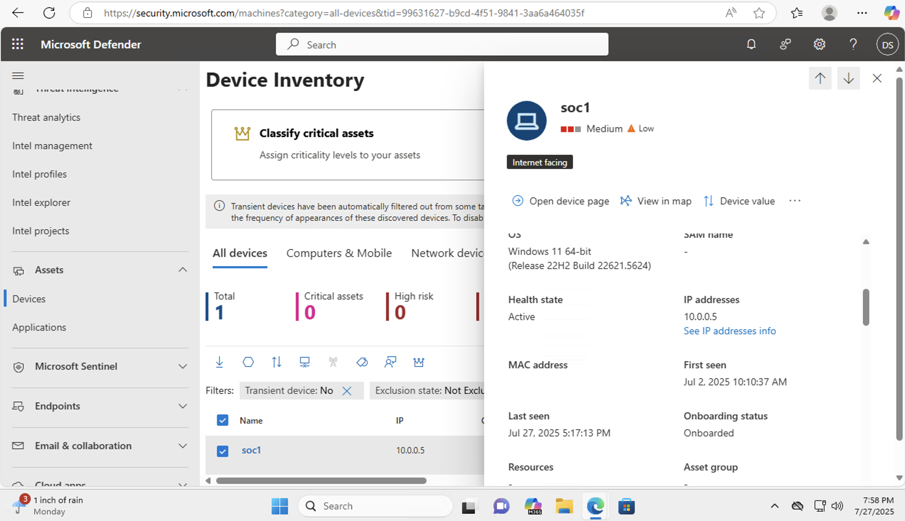
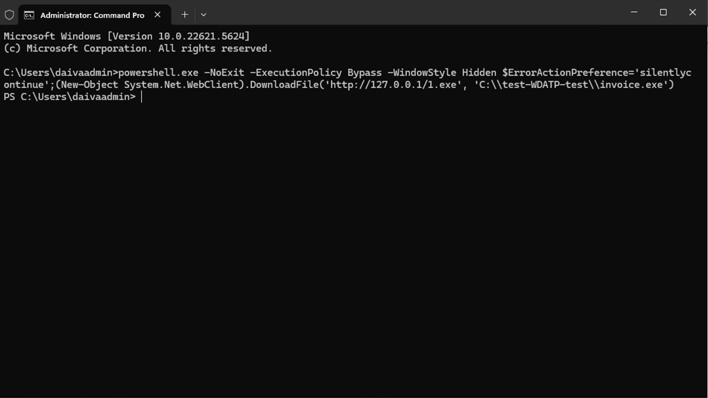
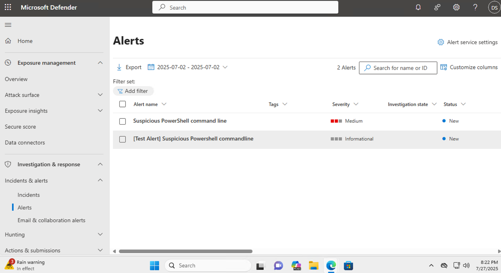
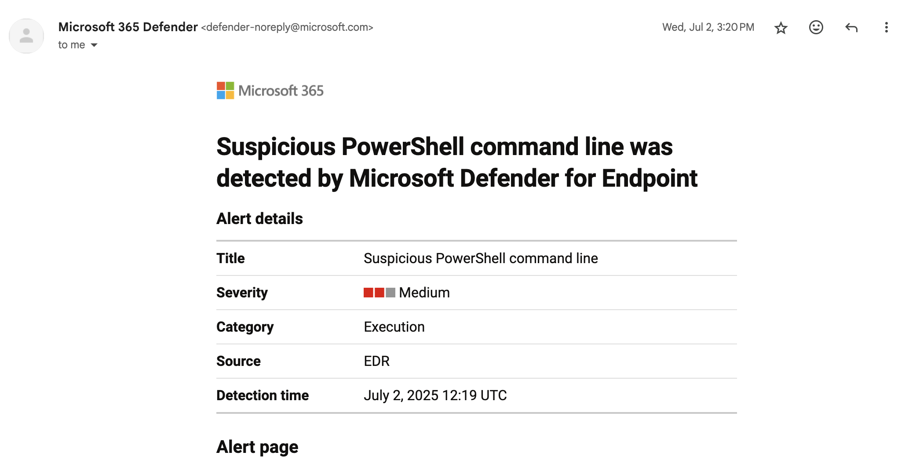
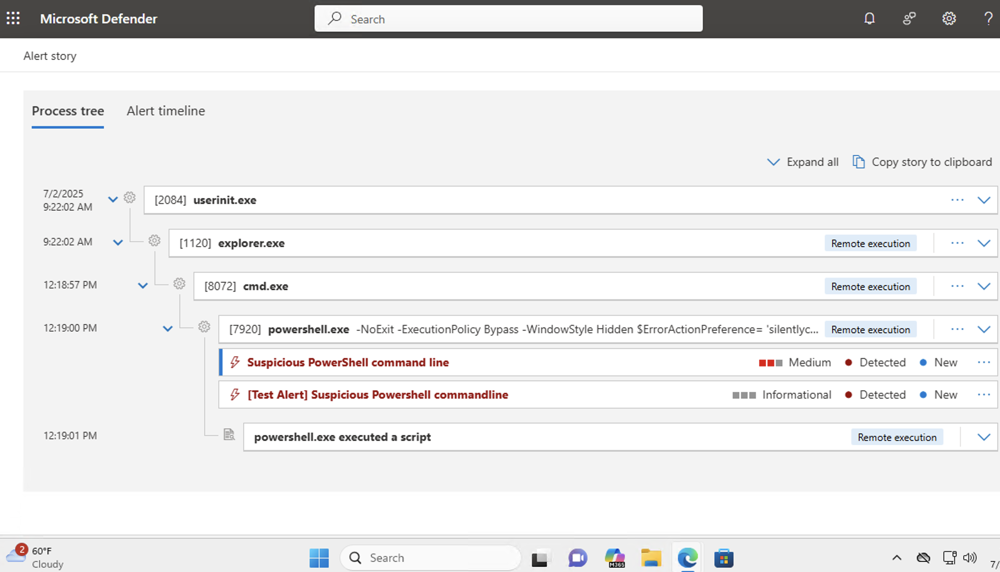
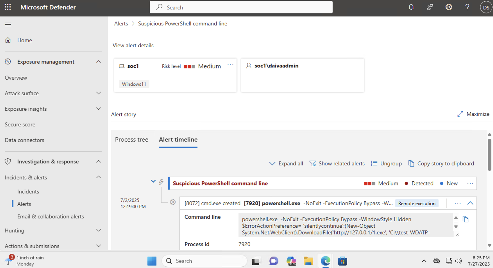

# Lab 2: Malware detection on endpoint using Microsoft Defender
This lab demonstrates how Microsoft Defender for Endpoint detects a potentially malicious PowerShell script executed on a Windows VM.

## 🎯 Goal
To simulate a basic malware detection scenario on an Azure virtual machine and observe how Microsoft Defender for Endpoint responds to suspicious script activity.

## ⚙️ Setup
- A Windows virtual machine (VM) was deployed on Azure (from Lab 1).
- The VM was onboarded to Microsoft Defender for Endpoint using a local onboarding script.
- Successful onboarding was confirmed via the Device Inventory in the Microsoft 365 Defender portal.
  

## 🧪 Scenario
A test script simulating malware behavior was executed via `cmd.exe` on the onboarded endpoint. The command included `-ExecutionPolicy Bypass` and `-WindowStyle Hidden`—parameters commonly associated with obfuscated or stealthy execution.

## ✅ Outcome
- Microsoft Defender triggered two alerts:
  - `Suspicious PowerShell command line` – **Medium**
  - `[Test Alert] Suspicious PowerShell commandline` – **Informational**
- Both alerts originated from the same process tree and execution.
- This confirmed that Defender for Endpoint successfully detects PowerShell-based suspicious activity in real time.

## 🖼️ Screenshots  
*The screenshots illustrate the simulated malware detection process, including alert generation, incident view in Microsoft 365 Defender, and PowerShell script execution.*

## 📌 Tools Used  
- Microsoft Defender for Endpoint  
- Microsoft 365 Defender Portal 
- Windows 11 Enterprise (via Azure) 
- Command Prompt (CMD)
- Azure Virtual Machine (created in Lab 1)

## 💡 Lessons Learned  
- How Microsoft Defender for Endpoint detects suspicious PowerShell behavior.  
- How to simulate basic endpoint threats in a controlled lab environment.  
- Gained experience investigating alerts and reviewing incident timelines.
  
## 📝 Notes
- No additional custom detection rules or policies were used.
- This lab focused purely on observing default Defender behavior during a simulated malware script test.
