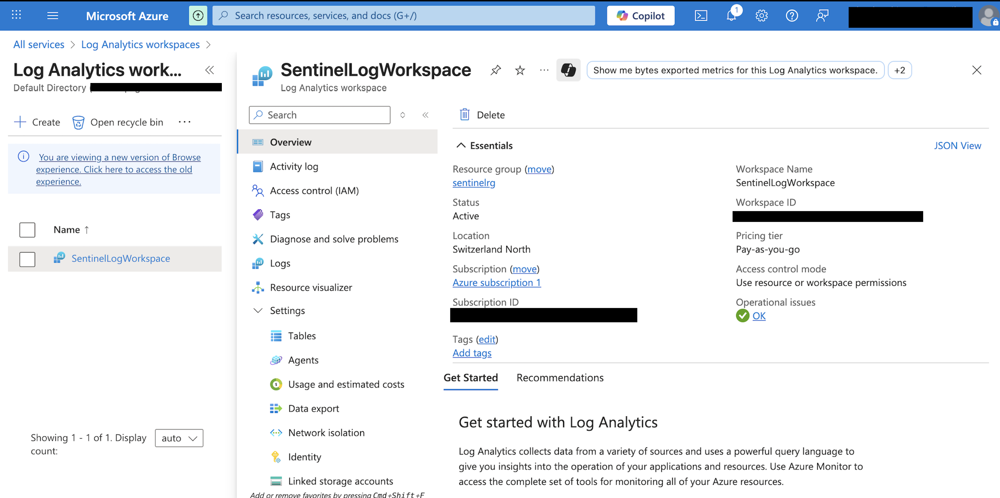
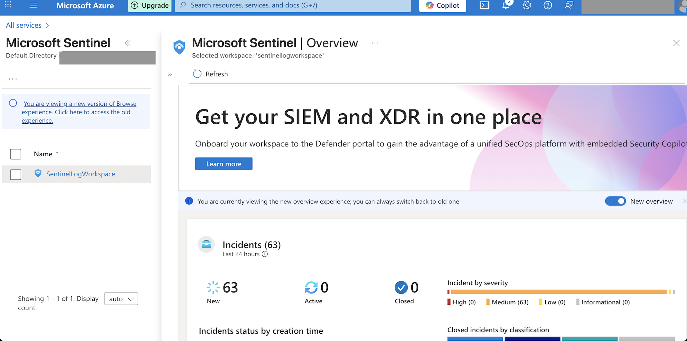
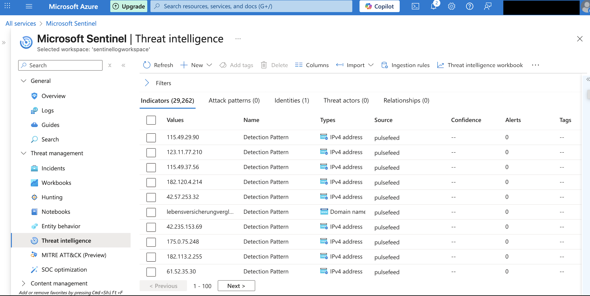
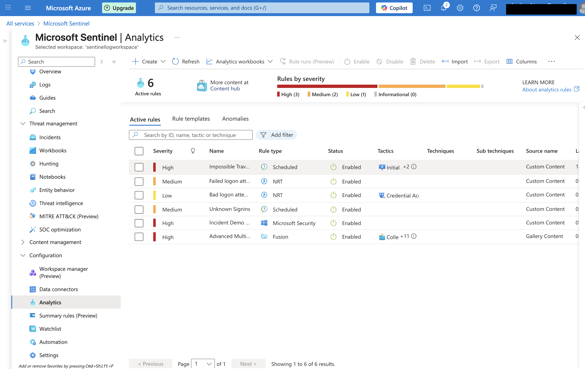
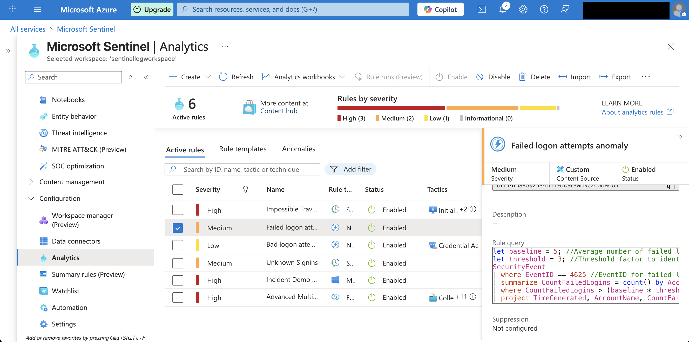
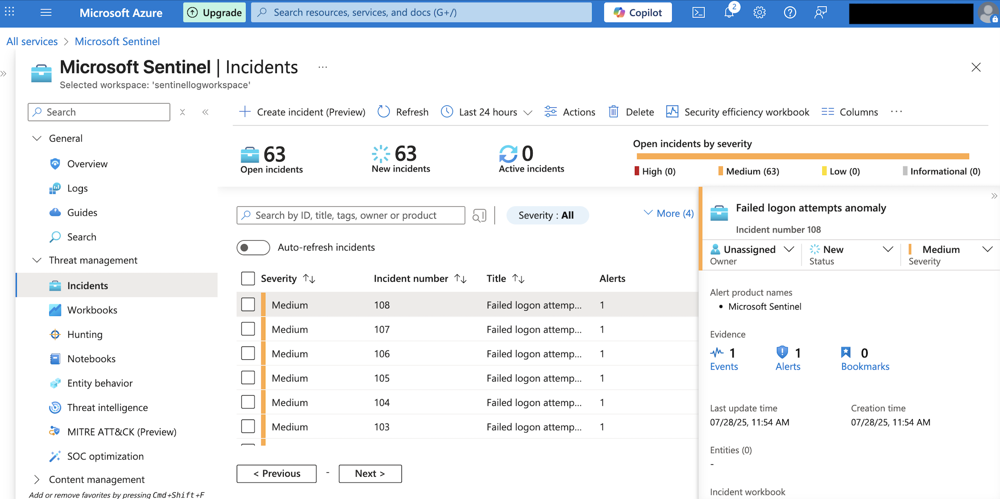
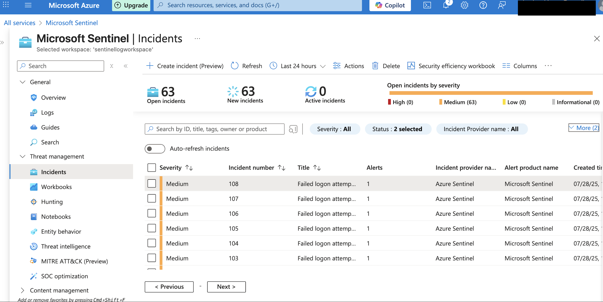

# lab3: Sentinel Configuration, Threat Intelligence, and Incident Investigation

## 🧩 Overview
In this lab, I configured a Log Analytics Workspace, added Microsoft Sentinel, integrated data sources, created analytics rules, and observed how alerts are generated and grouped into incidents.

## ⚙️ Configuration Steps

### 1. Log Analytics Workspace Setup
- Created a workspace: `SentinelLogWorkspace`
- Region: Switzerland North
- Access control: Resource-level (RBAC)
- Connected to Azure Subscription 1

  *This screenshot shows the Log Analytics Workspace created for Microsoft Sentinel.*

### 2. Added Microsoft Sentinel
- Enabled Microsoft Sentinel on the Log Analytics workspace
- Confirmed that Sentinel is running with no operational issues

  *This view confirms that Microsoft Sentinel is enabled and running on the selected Log Analytics Workspace.*

### 3. Data Connectors and Threat Intelligence

### Connected Data Sources:
- Azure Virtual Machine
- Connected via **Windows Security Events via AMA**

### Threat Intelligence (TAXII Connector):
- Enabled Threat Intelligence – TAXII data connector
- Connected **Pulsedive threat feed**
- Imported ~29,000+ IOCs (IP addresses, domains)
- Source visible in: **Sentinel > Threat Intelligence > Source: pulsefeed**

> Note: TAXII connector allows Microsoft Sentinel to receive real-time threat indicators from trusted open source feeds like Pulsedive.

  *Shows the connected threat feed via the TAXII connector.*

### 4. Alert Rule Configuration

Configured multiple **Analytics rules**, including:
- Failed logon attempts anomaly (NRT)
- Impossible travel detection (scheduled)
- Advanced Multistage Attack Detection (Fusion)

  *Displays the configured analytics rules: including near real-time (NRT), scheduled, and Fusion rules. These are used to simulate common SOC detection scenarios.*

### Analytics Rule: `Failed logon attempts anomaly`
- **Type:** Near Real-Time (NRT)
- ⏱ I used NRT rules to simulate real SOC scenarios and reduce detection delay
- **Severity:** Medium
- **Detection method:** Custom KQL query on `SecurityEvent` (EventID = 4625)
- **Purpose:** Detect brute-force or repeated failed login attempts

  *Shows the KQL logic used in the failed logon attempts anomaly rule. It dynamically detects multiple 4625 events over time* 

  *Shows the incident's metadata, including severity, status, alert source, and evidence counts.*

## 🚨 Alerting & Incident Investigation
- Alerts triggered by the rules were automatically grouped into incidents in Sentinel.
- All incidents in this case were related to suspicious failed login attempts.
- Investigated incident severity and source within Sentinel > Incidents.
- Demonstrated use of analytics rules and MITRE ATT&CK mapping.
  
  *Incident view showing how alerts triggered by the analytics rules were grouped into incidents.*

## 🔒 Key Learning Outcomes 
- Microsoft Sentinel configuration from scratch
- TAXII Threat Intelligence integration (Pulsedive)
- Creation of custom analytics rules using KQL
- SOC-style alert investigation and incident management
- Understanding of MITRE ATT&CK mapping in Sentinel

## 🖼️ Screenshots  
*The screenshots illustrated the process of configuring Microsoft Sentinel, including setting up a Log Analytics Workspace, enabling Sentinel, connecting the TAXII threat intelligence feed, creating custom analytics rules, and reviewing generated incidents based on simulated failed logon attempts.*

## 🎯 Lessons Learned  
- Real-time alerting relies entirely on correct log sources and rule logic  
- Without active log activity (e.g. failed logins), no alerts or incidents occur  
- Threat Intelligence integration is not automatic – it requires mapping via detection rules
