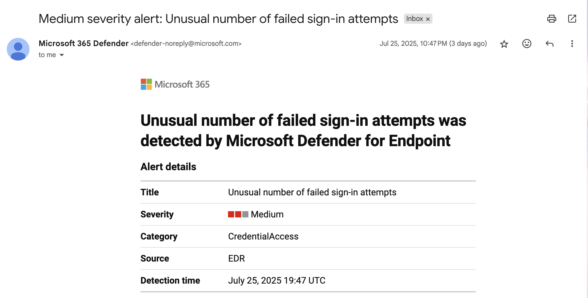
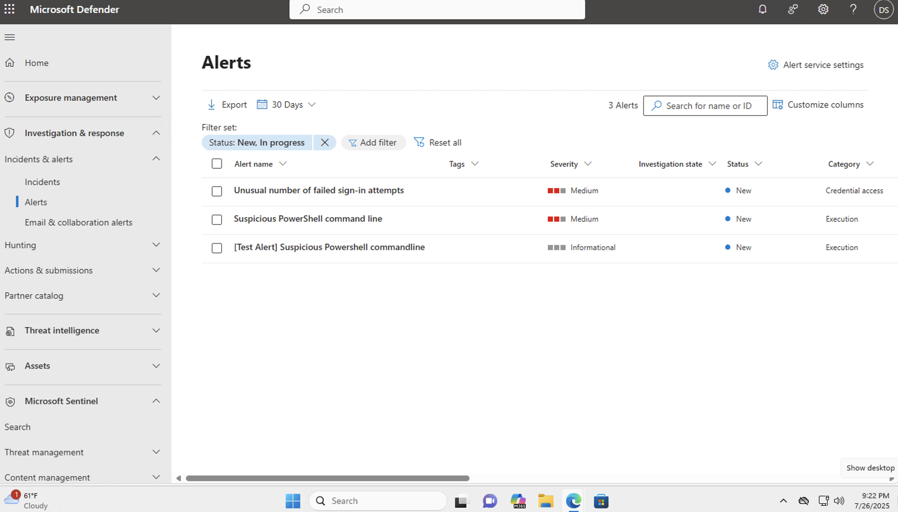
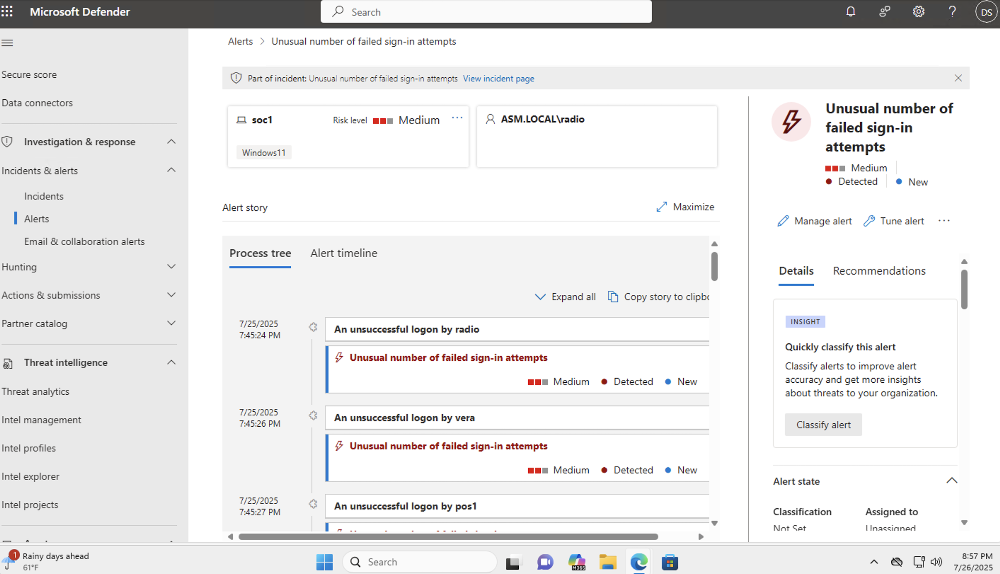
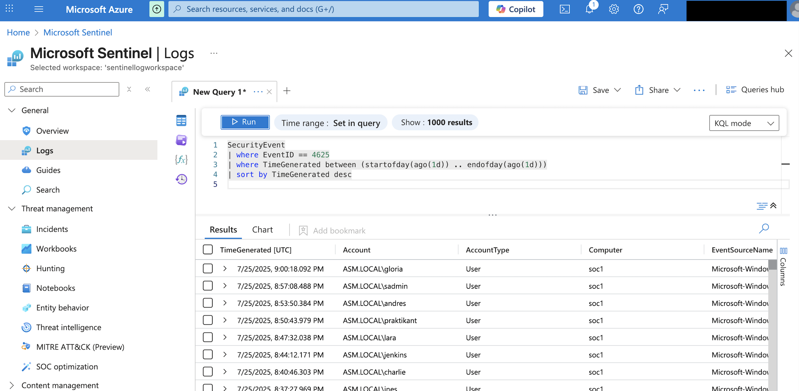
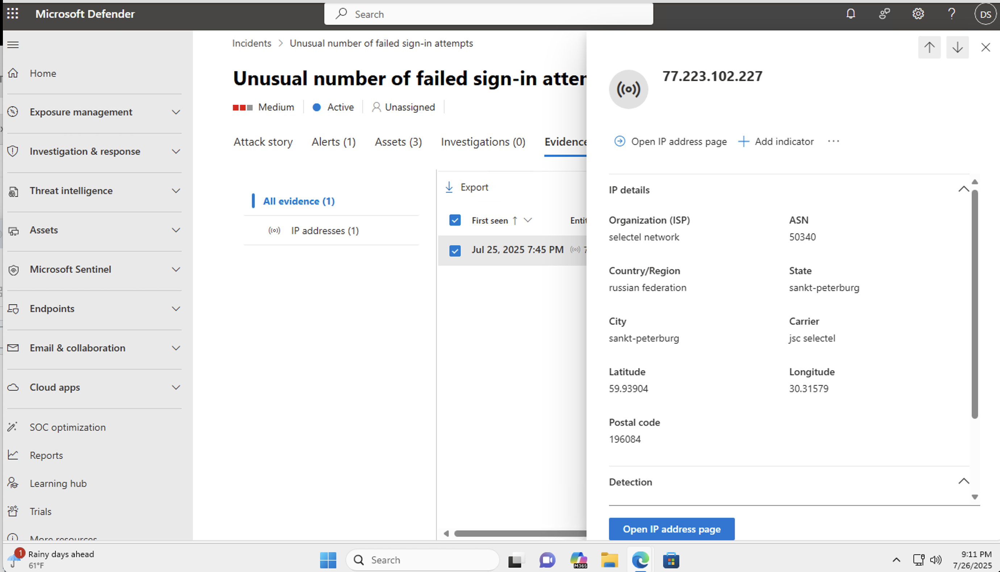
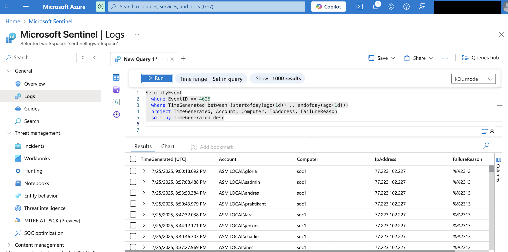
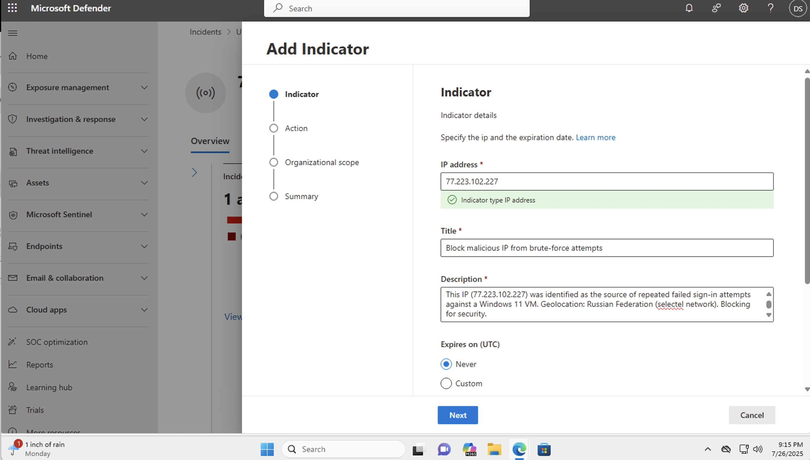
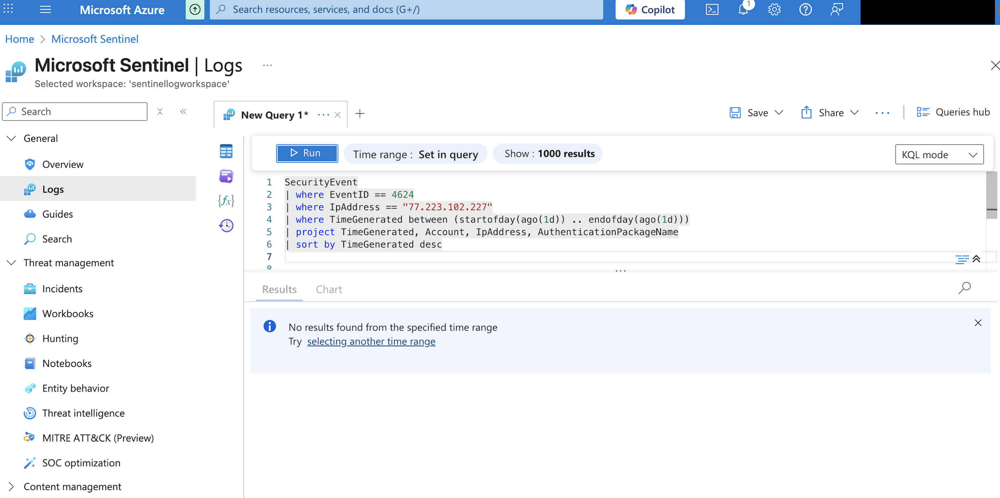
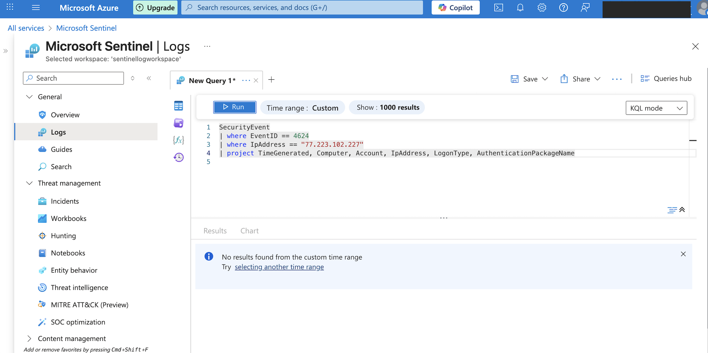
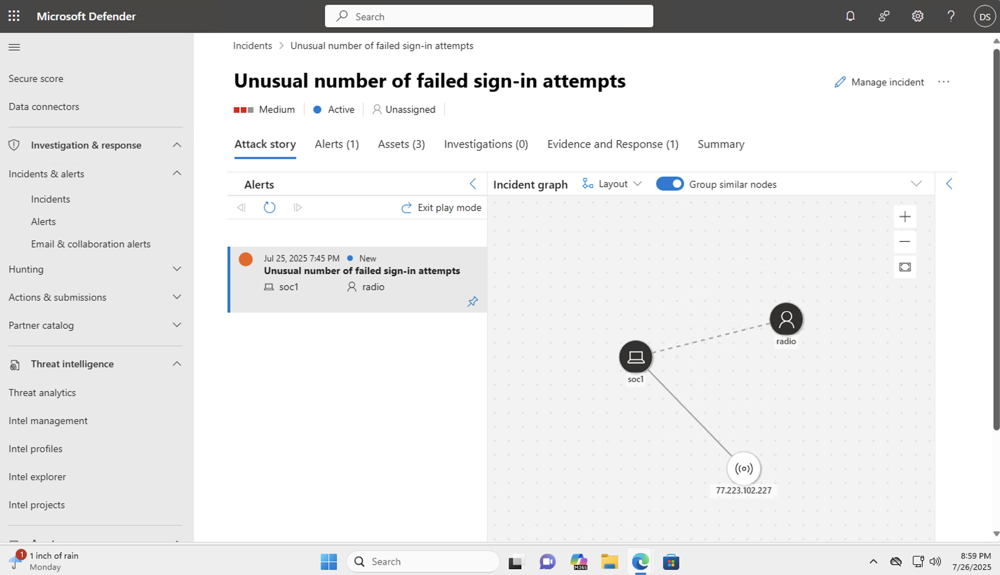

# Lab 4: Brute Force Attack Investigation & IP Block via Microsoft Defender

This lab documents a real brute-force login attempt detected on my Azure VM on July 25, 2025. Using Microsoft Sentinel and Defender for Endpoint, I investigated the incident, identified the malicious IP address, and blocked it via custom indicator.

## 🎯 Objective
The goal of this lab was to investigate a real brute-force login attempt targeting my Azure virtual machine and apply appropriate mitigation.
This involved identifying the malicious IP address using Microsoft Defender and Sentinel, and blocking it using a custom network indicator.

## 🖼️ Screenshots
The following screenshots document the investigation process, including alert details, Kusto queries, IP analysis, indicator creation, and post-mitigation verification steps.

## 🧩 Steps Overview

### 1. Detection and Alert:
- Created a custom analytics rule in Sentinel to detect multiple failed login attempts.
- Linked VM logs to Sentinel via Log Analytics Workspace.
- Received email alert from Microsoft Defender for Endpoint on **July 25, 2025**.

*This screenshot demonstrates alert notification received from Microsoft Defender for Endpoint indicating multiple failed sign-in attempts*

### 2. Investigation in Sentinel and Defender:
- Investigated the incident: entity details, IPs, login attempts.
- Queried SecurityEvent table for Event ID 4625 (failed login)
- Found multiple failed login attempts from IP 77.223.102.227
- Validated that the alert was triggered by a real attack.

*Overview of active Defender alerts, showing the brute force alert and its severity.*

*Timeline and process tree of login attempts tied to the "radio" user account.*
 

*Query for Event ID 4625 showing failed login attempts with associated user accounts and timestamps.*
 

*A total of **403 failed login attempts** were recorded from the attacker IP `77.223.102.227`, confirming the brute-force nature of the incident.*

### 3. IP Origin:
The IP address `77.223.102.227` was identified in Microsoft Defender for Endpoint by reviewing the alert and incident details.  
It was confirmed via Microsoft Sentinel by querying failed login logs (Event ID 4625).  
Geolocation analysis showed the IP originates from Russia (Selectel network).

*IP `77.223.102.227` identified as coming from Russia*
 

*IP confirmation in Sentinel*

### 4. Defender for Endpoint Response:
- Opened the incident in Microsoft Defender security portal
- From there, navigated to the related alert
- Added the attacker IP as a custom network indicator and set it to "Block"

*Indicator configured to block the IP, with description referencing brute-force attempts.*
  

### 5. Verification of IP Block

- After adding the IP as a custom network indicator in Microsoft Defender, I verified its effectiveness by running a Kusto query in Sentinel to search for any further failed login attempts from the same IP.
- The query returned no results, confirming that the IP was successfully blocked.
- No Event ID 4624 (successful login) was detected from the attacker’s IP (77.223.102.227), confirming the brute-force attempt failed.
  
*Kusto query filtering failed login attempts by the malicious IP after indicator was set to block.*
 

*Kusto query shows no successful logins from the attacker’s IP.*

*Visual graph of the incident showing relationships between the attacker IP, user, and affected VM.*

## 🔧 Tools Used
- Microsoft Sentinel
- Microsoft Defender for Endpoint
- Log Analytics Workspace
- Azure VM

## 🔒 Key Learning Outcomes
- Investigated a real-world brute force attack using Microsoft Defender and Sentinel
- Analyzed alert and incident details in Microsoft Defender security portal
- Identified attacker IP and created a custom network indicator to block it
- Queried failed login events in Microsoft Sentinel using Kusto
- Verified that the block was successful by confirming no further activity from the IP
- Strengthened understanding of end-to-end incident response: detection → analysis → mitigation → validation

## 🎯 Lessons Learned
- Real Defender alerts can indicate brute-force attacks even without a real user on the machine
- Alert data and Kusto logs can be used together to validate malicious behavior
- Creating custom indicators in Defender is an effective way to mitigate threats
- Always confirm mitigation worked by verifying absence of future attempts
